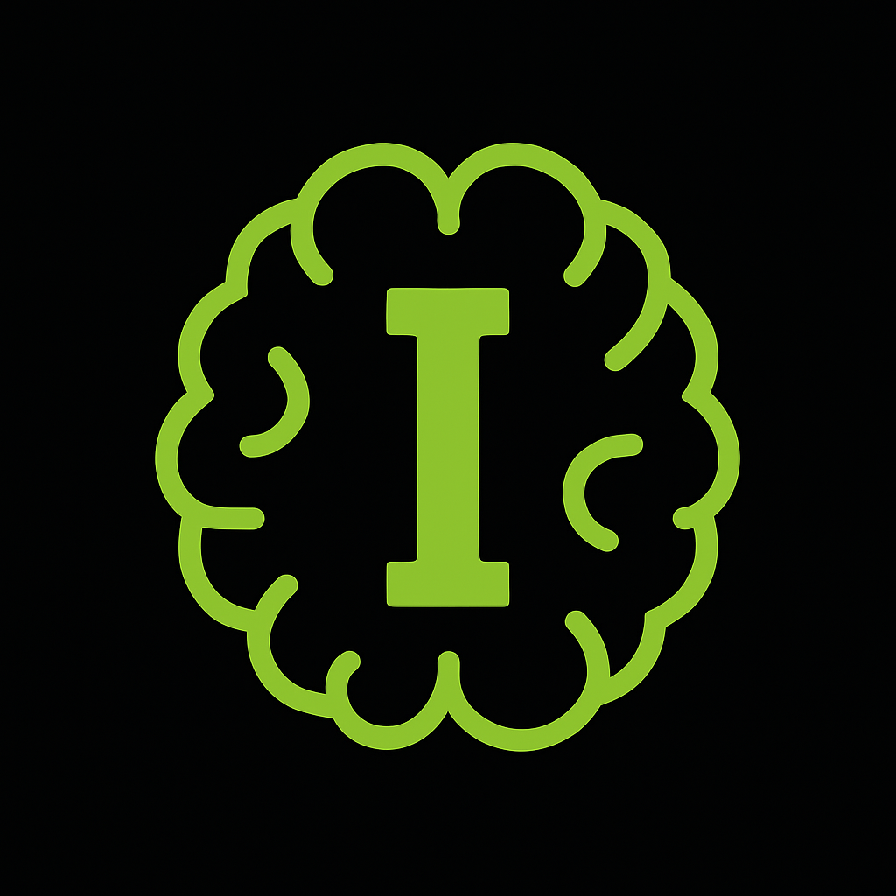

<p align="center">
  
</p>

<h1 align="center">🧠 i (I) Programming Language, iLang</h1>

<p align="center">
  <b>AI-driven, language-agnostic code synthesis framework for exploratory and research use</b><br/>
  <sub>Generate • Integrate • Orchestrate • Execute</sub>
</p>

---

## 📘 Quick Reference

Before diving into the **Overview**, check out the following usage guides and resources:

- 🗨️ [Chat Usage Guide](chat_usage.md) — Learn how to generate and stream code using **aiinterface.py**
- ⚙️ [Code Generation Usage](codegen_usage.md) — Explore how to use **codegen.py** to save model-generated code to files
- 🧠 [Available Models](models_for_codegen.md) — See all supported **OpenAI models** usable for code generation

> 💡 Currently, iLang connects directly to **OpenAI’s family of models** for all code generation tasks.

---

## 🔍 Overview

**I Programming Language** is an experimental framework for **AI-driven software creation**.
It generates, integrates, and orchestrates code across multiple programming languages using large language models (LLMs).
The goal is to enable **exploratory and research use** in **cross-language code synthesis**, where hybrid, language-agnostic scripts are created and executed seamlessly.

---

## ⚙️ Core Workflow

| Function | Purpose |
|-----------|----------|
| **C()** | Create — Generate a function in a chosen language via LLM |
| **E()** | Execute — Run the generated function in a sandboxed interpreter |
| **P()** | (Planned) Pipeline — Compose multiple generated functions |

---

### 🧩 Example

```python
# Create a simple function
myfunc = C(
    "Python",
    "3.13",
    "return the square of the input integer",
    int,
    [int]
)

# Execute it
result = E(myfunc, [3])
# -> 9
```

---

## 🧠 Under the Hood

Each `C()` call:
1. Builds a structured LLM prompt (e.g., “You are an expert Python developer”).
2. Generates code, dependencies, and unit tests.
3. Performs static and sandboxed validation.
4. Produces a **GeneratedFunction** object with:
   - Source code
   - Interpreter metadata
   - Provenance (model, prompt hash, dependencies)

Each `E()` call:
- Validates input/output schemas.
- Runs in an isolated, resource-limited environment.
- Returns structured results and execution logs.

---

## 🧱 Function Specification

```txt
FunctionSpec:
  lang: "python" | "c" | "javascript" | ...
  version: "3.13" | "17" | "20" | ...
  description: string
  result_type: Schema
  input_types: Schema[]
  packages?: string[]
  constraints?: { time_ms, memory_mb, net_access: false }
```

---

## 🧩 Extended Architecture: `.F`, `.X`, and `.I` Structure

iLang introduces a **multi-layered file architecture** to separate definition, generation, and integration:

| Layer | File/Dir | Purpose |
|--------|-----------|----------|
| **Definition** | `.F` | Defines abstract functions via LLM prompts |
| **Execution** | `.X/` | Contains generated source code and compiled artifacts (C or ASM) |
| **Integration** | `.I` | Combines compiled modules for execution and linkage |

### Example Structure

```
project/
├── example.F
├── example.X/
│   ├── example.f1.py
│   ├── example.f1.cpp
│   ├── example.f1.c
│   ├── example.f1.asm
│   └── ...
└── example.I
```

### 🔧 Function Definition (`.F`)

```txt
# example.F

f1 = C(Python, "add two numbers", int, [int, int])
f2 = C(C++, "square number", int, [int])
```

Each definition uses `C()` to declare:
- The source language
- Function description
- Input and output data types

---

### 🧩 Language Execution (`.X` Directory)

Generated code and compiled files are stored in the `.X/` directory.

```txt
example.X/
  ├── example.f1.py
  ├── example.f1.cpp
  ├── example.f1.c
  ├── example.f1.asm
```

Each function can be compiled to **C** or **ASM**:

```
f1 --> Python script --> compiled to C (or .H)
f2 --> C++ script --> compiled to C (or .H)
```

---

### 🔗 Integration Layer (`.I`)

The `.I` layer brings everything together for inclusion and execution:

```txt
# example.I

include "example.f1.c"
include "example.f2.c"

int main() {
    printf("%d", f1(3, 4));
    printf("%d", f2(5));
}
```

This enables **cross-language function composition**, allowing multiple generated functions to coexist and be compiled together.

---

## 🧩 Roadmap

| Milestone | Goal |
|------------|------|
| **M0** | Implement Python-only `C` and `E` with sandboxed execution |
| **M1** | Add C language integration and Python↔C interoperability |
| **M2** | Add JavaScript language integration and Python↔JavaScript interoperability |
| **M3** | Introduce `.F`, `.X`, `.I` pipeline for multi-language compilation |
| **M4** | Add pipeline composition (`P`) and cross-language stitching |
| **M5** | Research & Policy layer: dependency allowlists, provenance, reproducibility |

---

## 🔐 Safety & Isolation

All code runs in a **secure sandbox** (containerized or WASM-based).
- 🚫 No default network access
- ⏱️ Time and memory limits
- 📦 Dependency pinning
- 🧾 Provenance tracking (prompt, model, deps, hash)

---

## 🧭 Vision

> “Describe what you want — I will build it.”

**I Programming Language** aims to:
- Bridge human intent and machine execution
- Enable AI-native programming paradigms
- Explore reproducible, explainable AI code generation
- Serve as a foundation for **self-constructing software systems**

---

## 🧩 Author
**Usman Ahmad** <span style="color:limegreen">Selphaware</span>

---

## 📘 Next: Continue Reading

To explore the next stage of iLang development — including deeper insights into the `.F`, `.X`, and `.I` compilation pipeline, LLM integration strategies, and interoperability — continue to:

➡️ [Next: iLang_Architecture.md](iLang_Architecture.md)

---

<p align="center">
  <sub>© 2025 I Programming Language — Intelligent Language for AI-driven Software Creation</sub>
</p>
